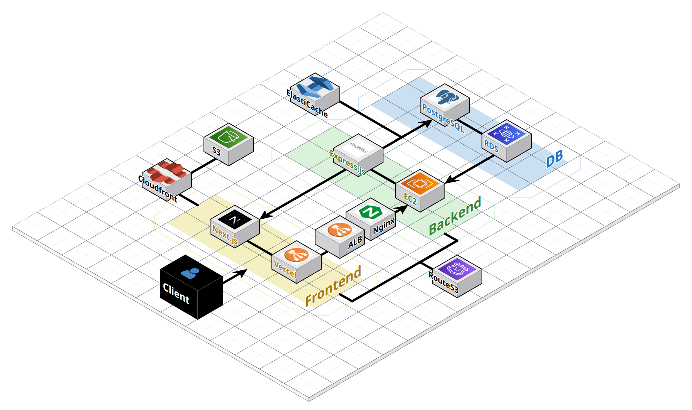

<div align="center">
  
</div>

# 투명하고 합리적인 이사! 무빙 보러가기 -> [무빙](https://www.gomoving.site/ko)

### Back-end 깃허브 [Back-end](https://github.com/WooGie911/Moving_BE)

# 📜 목차

1. [프로젝트 소개](#📝-프로젝트-소개)
2. [기능 구현 영상](#💻-기능-구현-영상)
3. [시스템 아키텍처](#🚧-시스템-아키텍처)
4. [기술 스택](#⚙️-기술-스택)
5. [주요 라이브러리](#📚-주요-라이브러리)
6. [팀 소개 및 문서](#👥-팀-소개-및-문서)
7. [개인별 주요 작업 내역](#📋-개인별-주요-작업-내역)
8. [프로젝트 구조](#📁-프로젝트-구조)
9. [주요 기능 상세](#🌟-주요-기능-상세)
10. [성능 최적화 전략](#🚀-성능-최적화-전략)
11. [트러블 슈팅](#💣-트러블-슈팅)

<br/>

# 📝 프로젝트 소개

- 기존 이사 과정의 번거로운 견적 요청과 가격 비교의 어려움을 해결합니다.
  고객이 이사 정보를 등록하면, 검증된 이사업체들이 경쟁적으로 견적을 제시합니다.
  고객은 다양한 견적과 조건을 한눈에 비교해 합리적인 선택이 가능하며, 리뷰를 통해 업체 신뢰도도 확인할 수 있습니다.
  이를 통해 투명하고 공정한 이사 준비와 비용 절감을 지원합니다.

<br/>

# 💻 기능 구현 영상 (추후 변경 예정)

[](https://youtu.be/EClrOPXoyFY)

<br/>

# 🚧 시스템 아키텍처

<div align="center">
  
</div><br/>

# ⚙️ 기술 스택

### ✅ Language


### ✅ Framework & Libraries


### ✅ Hosting & Deployment


### ✅ Storage & Database


### ✅ CI/CD


### ✅ Version Control


<br/>

# 📚 주요 라이브러리

<details>

<summary>데이터 패칭 / 캐싱</summary>

- **@tanstack/react-query**: 서버 상태 관리와 캐싱
- **@tanstack/react-query-devtools**: React Query 디버깅 도구
</details>

<details>
<summary>상태 관리</summary>

- **zustand**: 경량 클라이언트 상태 관리
</details>

<details>
<summary>국제화(i18n)</summary>

- **next-intl**: 서버/클라이언트 통합 국제화
</details>

<details>
<summary>인증 / 보안</summary>

- **jose**: JWT/JWE/JWS 등 JOSE 스펙 구현
</details>

<details>
<summary>폼</summary>

- **react-hook-form**: 퍼포먼스 중심의 폼 상태 관리
</details>

<details>
<summary>UI / UX 보조</summary>

- **react-toastify**: 토스트 알림
- **react-icons**: 아이콘 세트
- **react-intersection-observer**: 인터섹션 옵저버 훅(무한 스크롤 등)
- **react-simple-star-rating**: 별점 컴포넌트
</details>

<details>
<summary>콘텐츠 파싱 / 보안</summary>

- **dompurify**: XSS 방지용 HTML 정화
- **html-react-parser**: HTML 문자열 → React 노드 파싱
</details>

<details>
<summary>날짜 / 유틸</summary>

- **date-fns**: 날짜 유틸리티
- **lodash.throttle**: 스로틀링 유틸
- **nanoid**: 고유 ID 생성
- **clsx**: 조건부 클래스 문자열 생성
</details>

<details>
<summary>네트워킹 / 실시간</summary>

- **event-source-polyfill**: SSE 폴리필
</details>

<details>
<summary>모니터링</summary>

- **@sentry/nextjs**: Sentry 통합(서버/클라이언트 에러 추적)
</details>

<details>
<summary>개발 도구</summary>

- **eslint**, **eslint-config-next**, **@eslint/eslintrc**: 린팅 구성
- **prettier**, **prettier-plugin-tailwindcss**: 코드/클래스 정렬 포매팅
- **tailwindcss**, **@tailwindcss/postcss**: 스타일링 구성
- **typescript**, **@types/node**, **@types/react**, **@types/react-dom** 등: 타입 시스템
- **jest**, **@testing-library/react**, **@testing-library/jest-dom**, **@testing-library/user-event**: 단위/컴포넌트 테스트
- **@next/bundle-analyzer**: 번들 사이즈 분석
- **@svgr/webpack**: SVG → React 컴포넌트 변환
- **concurrently**: 멀티 스크립트 병렬 실행
</details>

<br/>

# 👥 팀 소개 및 문서 (보고서쪽 배포 페이지로 주소 변경하기, 팀노션도 포함)

## 팀원 소개

| 이름   | 역할           | GitHub                                           | 개인 개발 보고서                                                                          |
| ------ | -------------- | ------------------------------------------------ | ----------------------------------------------------------------------------------------- |
| 김재욱 | 🍉 팀장        | [@WooGie911](https://github.com/WooGie911)       | [보고서](https://admitted-turkey-c17.notion.site/2155da6dc98c812287d7d940549998e4?pvs=74) |
| 김승준 | 🍒 BE 담당자   | [@y10b](https://github.com/y10b)                 | [보고서](https://admitted-turkey-c17.notion.site/2155da6dc98c81e19d89d0e8adf8d8ff?pvs=74) |
| 백지연 | 🍑 발표 담당자 | [@jyeon03](https://github.com/jyeon03)           | [보고서](https://admitted-turkey-c17.notion.site/2155da6dc98c8111b5e1d87be8af392c?pvs=74) |
| 김수빈 | 🍇 부팀장      | [@subinkim9755](https://github.com/subinkim9755) | [보고서](https://admitted-turkey-c17.notion.site/2155da6dc98c81a1b126fa5807952847?pvs=74) |
| 윤세준 | 🍎 문서 담당자 | [@YSJ0228](https://github.com/YSJ0228)           | [보고서](https://admitted-turkey-c17.notion.site/2155da6dc98c8196b70deae13a63889d)        |
| 박민규 | 🍈 FE 담당자   | [@gksktl111](https://github.com/gksktl111/)      | [보고서](https://admitted-turkey-c17.notion.site/2155da6dc98c81e4bc88ead73004b379?pvs=74) |

## 팀 문서

📝 [팀 노션](https://admitted-turkey-c17.notion.site/Part4-Team1-Moving-2155da6dc98c80fa89c2f08319b1ef83?pvs=74)

<br/>

# 📋 개인별 주요 작업 내역

<details>
<summary>🍉 김재욱</summary>

## frontend

- **리뷰 페이지**
  - 작성 가능한 리뷰 페이지 + 리뷰 작성 모달
  - 내가 작성한 리뷰 목록 페이지
  - `React Query` 기반 상태 관리
  - 별점 선택 + 텍스트 입력 검증

- **실시간 알림 시스템**
  - `event-source-polyfill` 기반 SSE 실시간 알림
  - `Zustand` 알림 데이터 상태 관리
  - `React Query` 알림 목록 상태 관리
  - 실시간 알림 수신 + 표시

- **공통 컴포넌트**
  - Input 공통 컴포넌트 제작
  - 재사용 가능한 UI 컴포넌트 설계

## backend

- **리뷰 시스템**
  - Prisma 미들웨어로 견적 확정 시 빈 리뷰 자동 생성
  - 이사 완료 후 리뷰 작성 가능 (빈 리뷰 PATCH)
  - 1:1 관계 보장 (하나의 확정 견적당 하나의 리뷰)

- **실시간 알림 시스템**
  - 액션 테이블 기반 로그/알림 관리 (확장성 고려)
  - Prisma 미들웨어로 액션 생성 감지 + 알림 자동 생성
  - SSE 실시간 알림 전송
  </details>

<details>
<summary>🍒 김승준</summary>

## frontend

- **견적요청 페이지**
  - 활성 견적 상태에 따른 스마트 라우팅 (생성/수정 자동 분기)
  - 채팅형 UI: 4단계 프로세스 (이사종류 → 날짜 → 출발지 → 도착지)
  - `date-fns` 기반 커스텀 달력 (타임존 이슈 해결, UTC 기준)
  - 카카오 주소 검색 + 에러 복구 로직
  - 폼 이탈 방지 시스템 (`useUnsavedChangesGuard`)
  - `React Query` 기반 상태 관리 + `Dirty Check`

- **찜한 기사님 페이지**
  - 무한스크롤 (`React Query Infinite Query` + `Intersection Observer`)
  - 대량 선택/삭제 + 옵티미스틱 업데이트
  - 실패 시 캐시 롤백으로 데이터 일관성 보장
  - Set 기반 선택 상태 관리 + 병렬 삭제 처리
  - 스크롤 투 탑 버튼 + ARIA 접근성 지원

- **기사님 일정 관리 페이지**
  - 월별 스케줄 캘린더 + 선택 날짜 상세 정보 (3:1 그리드 레이아웃)
  - `React Query` 월별 데이터 조회 + `useMemo` 날짜별 그룹화
  - 커스텀 캘린더 컴포넌트 (`date-fns` + UTC 기준 날짜 처리)
  - 스케줄 상태별 스타일링 + 접근성 지원 (ARIA, 시맨틱 HTML)
  - 안전한 번역 처리 (fallback 기본값 + 번역 로드 상태 확인)

- **다국어 처리 시스템**
  - `next-intl` (`useTranslations`, `useLocale`) 기반 다국어 지원
  - 언어별 날짜 포맷팅 (한국어: YYYY년 MM월 DD일, 영어: MM/DD/YYYY)
  - 번역 실패 시 언어별 기본값 처리 + 번역 키 검증
  - 요일/월명 다국어 처리 + UTC 기반 타임존 이슈 해결

## backend

- **견적요청 시스템**
  - 견적요청 CRUD API (생성/조회/수정/취소)
  - 권한/프로필 확인 + 입력 검증 (이사일, 주소, 이사유형)
  - Sentry 에러 모니터링 + 캐시 무효화 처리

- **스케줄러 시스템**
  - 기사님 월별 스케줄 조회 API + Redis 캐싱 (60초 TTL)
  - 자동화 스케줄러: 만료 처리 (00시), 알림 생성 (09시)

- **찜하기 시스템**
  - 찜하기 CRUD API + 소프트 삭제/멱등성 보장
  - DB 모델: 고객-기사 중복 방지 (@@unique 제약)
  - CUSTOMER 권한 전용 + 관련 캐시 무효화

- **다국어 시스템**
  - 번역 미들웨어 (?lang=ko|en|zh) + excludeKeys 처리
  - 번역 실패 시 원본 응답 + Sentry 기록

- **Redis 캐싱**
  - GET 요청 캐싱 + 사용자별 분기 (varyByAuth)
  - 캐시 키 규칙 + 자동 무효화 시스템

</details>

<details>
<summary>🍑 백지연</summary>

## frontend

- **기사님 찾기 페이지**
  - 실시간 디바운싱 검색 (100ms 지연) + 드롭다운 필터링
  - 무한스크롤 (`react-intersection-observer` + `useInfiniteQuery`) + 4개씩 페이지네이션
  - `Zustand` 상태 관리 (검색/필터/정렬)
  - 찜하기 기능 + PC 미리보기 사이드바
  - `useMemo` 성능 최적화 + Sentry 에러 추적

- **기사님 상세 페이지**
  - 동적 라우팅 (`useParams`) + 상세 정보 조회
  - 프로필/경력/평점/리뷰 정보 표시
  - 서비스 타입/지역 다국어 처리
  - 견적요청/지정견적/찜하기 액션 버튼
  - 소셜 공유 (카카오톡/페이스북/링크)

- **랜딩 페이지**
  - 4단계 서비스 이용 과정 인포그래픽
  - 반응형 이미지 처리 (`Next.js Image` + WebP)
  - CSS 애니메이션 (트럭 슬라이드인, 펄스 효과)
  - 접근성 (ARIA, 시맨틱 HTML, 스킵 링크)

## backend

- **기사님 조회 시스템**
  - REST API: 목록/상세/찜한목록 조회
  - `optionalAuth` 미들웨어로 로그인/비로그인 지원
  - Prisma 기반 페이지네이션/필터링/정렬

- **검색/필터 시스템**
  - 닉네임/지역 기반 텍스트 검색 (OR 조건)
  - 지역별/서비스타입별 필터링 + DB 인덱스 최적화
  - 리뷰수/평점/경력/완료건수 기준 정렬

- **다국어/모니터링**
  - 번역 미들웨어 (?lang=ko|en|zh)
  - Sentry 에러 추적 + 액션 로그
  - 권한 검증 + 비즈니스 규칙 검증

</details>

<details>
<summary>🍇 김수빈</summary>

## frontend

- **유저 - 견적 관리 페이지**
  - 이사 견적 확정, 반려 기능 구현
  - 간단한 견적, 이사, 기사 정보가 포함된 카드 리스트 UI 구현
  - `React Query`를 이용한 직접적인 API 호출
  - 유틸함수를 통한 안정적인 다국어 날짜 처리 (formatDateWithDay)

- **기사 - 견적 관리 페이지**
  - 견적 받기, 반려 기능 구현
  - 간단한 견적, 이사, 기사 정보가 포함된 카드 리스트 UI 구현
  - `React Query`를 이용한 직접적인 API 호출
  - 유틸함수를 통한 안정적인 다국어 날짜 처리 (formatDateWithDay)
  - React 훅을 이용한 비제어 컴포넌트 리렌더링 방지

- **공통 Chip 컴포넌트**
  - 박스형 및 클릭 여부 등을 포함한 조건부 렌더링을 고려한 설계

- **SNS 공유 기능**
  - 카카오 SDK를 이용한 카카오 API 사용
  - 피드 형태로 제목, 설명, 이미지, 링크 포함
  - 실패 시 클립보드 복사로 대체
  - 페이스북 공유 API URL 사용
  - Open Graph 메타 태그를 동적으로 설정하여 미리보기 개선
  - 공유 텍스트를 클립보드에 복사하여 사용자 편의성 제공
  - 팝업 창으로 공유 페이지 열기

## backend

- **유저 견적 관리 API**
  - 견적 조회 및 확정, 거절 API 구현
  - MVC 패턴으로 명확한 계층 분리
  - Redis 캐싱을 통한 빠른 응답 속도 및 DB 부하 감소
  - 트랜잭션 처리로 인한 데이터 일관성 보장

- **기사 견적 관리 API**
  - 견적 조회 및 견적 보내기, 반려하기 API 구현
  - MVC 패턴으로 명확한 계층 분리
  - Redis 캐싱을 통한 빠른 응답 속도 및 DB 부하 감소
  - 트랜잭션 처리로 인한 데이터 일관성 보장

- **스케줄러 시스템**
  - `node-cron`을 통한 스케줄러 작성
  - 서버 시작 시 스케줄러 초기화 및 Sentry를 통한 에러 추적
  - 모든 크론 작업을 중앙 집중식으로 관리, 각 작업별 명확한 함수 분리

</details>

<details>
<summary>🍎 윤세준</summary>

## frontend

- **공통 페이지네이션 시스템**
  - `usePagination` 커스텀 훅 + 복잡한 페이지네이션 로직
  - 반응형 디자인 (sm/lg 크기 옵션)
  - `useMemo` 성능 최적화 + 재사용성 제공
  - 여러 페이지에서 일관된 페이지네이션 경험

- **기사님 마이페이지**
  - 통합 데이터 로딩 (사용자 정보 + 기사님 정보 병렬 처리)
  - 반응형 레이아웃 (데스크톱/모바일 최적화)
  - 단계별 에러 상태 관리 + 안정적인 사용자 경험

- **기사님 프로필 수정 페이지**
  - Presigned URL 기반 S3 업로드 (보안성 + 성능)
  - FileReader API 실시간 이미지 미리보기
  - `React Hook Form` 복잡한 폼 상태 관리 + 유효성 검사

- **기사님 기본정보 수정 페이지**
  - 조건부 렌더링 (일반/소셜 로그인 사용자별 UI)
  - 동적 레이아웃 (사용자 타입별 1열/2열 자동 전환)
  - 로그인 방식별 조건부 검증 로직

## backend

- **페이지네이션 API**
  - 표준 페이지네이션 API 구조
  - 페이지 기반 데이터 조회 시스템

- **기사님 마이페이지 API**
  - 통합 API 설계 (필요한 모든 데이터 효율적 조회)
  - Prisma 복잡한 관계 데이터 조회 최적화

- **기사님 프로필 관리 시스템**
  - S3 클라이언트 안전한 파일 업로드
  - 프로필 데이터 유효성 검사 + 비즈니스 로직

- **기사님 기본정보 관리 시스템**
  - 사용자 타입별 처리 (일반/소셜 로그인 분리)
  - bcrypt 비밀번호 해싱 + 검증
  - 민감정보 암호화 저장 (전화번호 등)

</details>

<details>
<summary>🍊 박민규</summary>
 
## frontend

- **로그인/회원가입 페이지**
  - 이중 사용자 타입 지원 (CUSTOMER/MOVER 별도 페이지)
  - 소셜 로그인: Google, Kakao, Naver OAuth 연동
  - `React Hook Form` + 실시간 유효성 검사
  - 14분 주기 자동 토큰 갱신, 중복 갱신 방지
  - `next-intl` 기반 다국어 지원 + ARIA 접근성

- **프로필 등록 페이지**
  - 사용자 타입별 맞춤 폼 (CUSTOMER/MOVER)
  - S3 직접 업로드 + CloudFront URL 생성
  - 파일명 타임스탬프 변경으로 보안 강화
  - 17개 시도/3개 서비스 타입 선택 UI
  - 글자 수 카운터 + 실시간 검증

- **프로필 수정 페이지**
  - 기존 정보 자동 로딩 + 타입별 분기 처리
  - 소셜 로그인 계정 보안 처리 (이메일 읽기전용, 비밀번호 변경 제한)
  - 현재/새 비밀번호 교차 검증
  - 수정 완료 후 전역 사용자 정보 갱신

## backend

- **인증 시스템**
  - `JWT` 기반 이중 토큰 (Access 15분 + Refresh 2주)
  - 슬라이딩 세션: Refresh Token 만료 5일 전 자동 재발급
  - `Passport.js` 기반 소셜 로그인 (Google, Kakao, Naver)
  - 쿠키 기반 토큰 저장 (httpOnly, secure)

- **보안 시스템**
  - bcrypt 비밀번호 해싱 (salt rounds: 10)
  - 전화번호 AES-256-CBC 암호화 저장
  - Rate Limiting: 로그인/회원가입 요청 제한
  - 미들웨어: `verifyAccessToken`, `verifyRefreshToken`, `optionalAuth`

- **데이터 검증**
  - 이메일: 허용 TLD 리스트 기반 검증
  - 비밀번호: 8자 이상, 영문/숫자/특수문자 조합
  - 전화번호: 한국 형식 (010xxxxxxxx) 검증
  - 이름: 한글/영문/중국어 1-15자

</details>

# 📁 프로젝트 구조

```
public/
├── img/                         # 정적 이미지(README, 로고 등)
├── favicon.ico
└── og-image.png

src/
├── app/                         # App Router 엔트리(서버/클라이언트 컴포넌트)
│   ├── [locale]/                # 다국어 라우팅 루트(next-intl)
│   │   ├── (auth)/              # 로그인/회원가입 등 인증 플로우
│   │   ├── estimate/            # 견적 관련 페이지
│   │   ├── estimateRequest/     # 견적 요청 관련 페이지
│   │   ├── favoriteMover/       # 즐겨찾기한 기사님
│   │   ├── moverMyPage/         # 기사님 마이페이지
│   │   ├── profile/             # 프로필(등록/수정)
│   │   ├── review/              # 리뷰 작성/조회
│   │   ├── searchMover/         # 기사님 검색/상세
│   │   ├── layout.tsx
│   │   └── providers.tsx
│   ├── error.tsx
│   ├── globals.css
│   └── layout.tsx
├── assets/                      # 개발용 에셋
├── components/                  # 도메인/공통 UI 컴포넌트
├── constant/                    # 상수 모음
├── hooks/                       # 커스텀 훅
├── i18n/                        # 국제화 라우팅/메시지 키
├── layout/                      # 레이아웃 관련 모듈(보조)
├── lib/                         # API/서버 액션/유틸 등 라이브러리 계층
│   ├── actions/                 # 서버 액션(쿠키 등 서버 전용 로직)
│   ├── api/                     # API 클라이언트(토큰 갱신 포함)
│   └── utils/                   # 공용 유틸 함수
├── messages/                    # 다국어 번역 메시지(ko/en/zh)
├── pageComponents/              # 페이지 조립용 컨테이너 컴포넌트
├── providers/                   # 전역 Provider(Auth/Query 등)
├── services/                    # 도메인 서비스(비즈니스 로직)
├── stores/                      # 전역 상태(zustand)
├── types/                       # 전역 타입 정의
├── utils/                       # 범용 유틸 함수
├── instrumentation-client.ts    # Sentry 등 클라이언트 계측 설정
├── instrumentation.ts           # Sentry 등 서버 계측 설정
└── middleware.ts                # Next 미들웨어(i18n/토큰 존재 등)
```

<br/>

# 🌟 주요 기능 상세

<details>
<summary>1. 인증 시스템</summary>

- **유저 타입별 로그인/회원가입**
  - 일반 유저 / 기사님 별도 페이지 및 권한 부여
  - 일반 가입 시 이름/이메일/전화번호/비밀번호 유효성 검사
- **소셜 로그인/회원가입**
  - Google · Naver · Kakao 지원
- **유저 타입 변경**
  - 일반유저 ↔ 기사님 ID 전환
  - 반대편 계정으로 로그아웃 없이 전환 가능
- **로그아웃**
  - DB 리프레쉬 토큰 삭제 및 클라이언트 쿠키 삭제
- **리프레쉬 토큰 갱신**
  - JWT 슬라이딩 세션 기반 리프레쉬 토큰 갱신 로직 (현재 14분 마다 선제 갱신 요청중, 만료는 15분)
- **요청 제한**
  - (`express-rate-limit를`) 이용한 무차별 대입 공격 방어를 위한 API 속도 제한 적용
- **토스트 모달 출력**
  - 성공/경고/오류 메시지를 고정 텍스트로 백엔드에서 전달받아 프론트엔드에서 직접 번역 처리(정적 텍스트이기 때문, deepL 사용의 최소화를 위함)

  </details>

<details>
<summary>2. 프로필 등록/수정</summary>

- **이미지 업로드(UI)**
  - 이미지 파일만 허용, 선택 시 타임스탬프 리네이밍(서명 불일치 방지)
  - S3 업로드 후 즉시 미리보기, 스켈레톤 → 실제 이미지(LCP 우선)
  - CloudFront CDN으로 전역 엣지 캐싱 서빙

- **폼 UI(텍스트/선택/편집)**
  - 텍스트: 한 줄 소개(최대 30자), 상세 소개(최대 300자) 그외 다양한 유효성 검사 폼
  - 선택: 서비스(다중 토글) · 지역(단일/다중, 로케일별 그리드)
  - 편집: 기존 값 프리필, 취소/저장 버튼과 비활성화 상태 제공
- **프로필 조회 api 캐싱**
  - 캐시 미들웨어: (`cacheMiddleware.ts`)를 통한 자동 캐싱 처리
  - 기존 응답 속도 평균 80ms 에서 평균 25ms로, 68.75%의 성능 개선 확인
- **토스트 모달 출력**
  - 성공/경고/오류 메시지를 고정 텍스트로 백엔드에서 전달받아 프론트엔드에서 직접 번역 처리(정적 텍스트이기 때문, deepL 사용의 최소화를 위함)
  </details>

<details>
<summary>3. 견적 요청 </summary>

- **채팅형 이사 정보 입력**
  - 이사종류/날짜/출·도착지
- **주소 입력**
  - 카카오 우편번호 서비스 적용
- **프로그래스 바**
  - 각 단계 표시, 각 항목 **수정 가능**
- **커스텀 달력 UI**
  - (`date-fns`) 기반 매트릭스/월 전환, 한국날짜 기준 날짜 생성(타임존 이슈 회피), 과거·오늘 비활성화, 다국어 요일 지원
- **요청 제한 규칙**
  - 이사일 경과 후 새 요청 가능
  - 활성 요청 1건만 유지
  - 견적 수: 최대 5개
- **요청 제한**
  - express-rate-limit를 이용한 무차별 대입 공격 방어를 위한 API 속도 제한 적용
- **견적 조회 api 캐싱**
  - 캐시 미들웨어: (`cacheMiddleware.ts`)를 통한 자동 캐싱 처리
  - 기존 응답 속도 평균 155ms 에서 평균 6ms로, 96.13%의 성능 개선 확인
- **폼 이탈 방지**
  - 커스텀 훅(`useUnsavedChangesGuard`)으로 새로고침(beforeunload)·뒤로가기(popstate)·링크 클릭·F5/Ctrl+R을 가로채 확인 모달로 차단하고, 제출 시 `bypassFor`로 일시 해제
- **토스트 모달 출력**
  - 성공/경고/오류 메시지를 고정 텍스트로 백엔드에서 전달받아 프론트엔드에서 직접 번역 처리(정적 텍스트이기 때문, deepL 사용의 최소화를 위함)
  </details>

 <details>
 <summary>3. 기사님 찾기</summary>
 
 - **검색/필터/정렬 시스템**
   - 실시간 디바운싱 검색(별명/지역), 검색어 초기화 버튼
   - 지역/서비스 타입 드롭다운 필터, 전체 필터 초기화 지원
   - 정렬: 리뷰·평점·경력·확정 횟수 기준, zustand로 상태 관리
 
 - **무한 스크롤 목록**
   - `useInfiniteQuery` + `react-intersection-observer`로 구현
   - 4개씩 페이지네이션, 스크롤 500px 이상 시 맨 위로 가기 버튼 하단에 출현
   - 스켈레톤 로딩, 에러 상태 처리, 검색 결과 없음 안내
 
 - **기사님 카드 정보**
   - 프로필 이미지, 별명, 한 줄 소개, 평점/리뷰 수/경력/완료 건수
   - 30건 이상 완료 시 전문 기사 배지 표시
   - 모바일/데스크톱 반응형 레이아웃, 찜하기 버튼 포함
 
 - **상세 페이지**
   - 기사님 소개: 프로필/경력/평점/찜 수, 상세 소개 더보기/접기
   - 서비스/지역 정보 칩, 리뷰 평점 요약 및 고객 리뷰 목록
   - 견적 요청/지정 견적 버튼, 소셜 공유(카카오톡/페이스북/링크)
   - `aria-label`, `role` 등 웹 접근성 지원, 스킵 링크 제공
 
 - **찜하기/공유 기능**
   - 로그인 필요, React Query로 캐시 자동 갱신
   - PC에서 우측 사이드바에 찜한 기사님 최대 3명 미리보기
   - 공유 메시지 자동 생성(기사님 정보 + 추천 멘트), 모바일/데스크톱 위치 차별화
방지
   </details>

<details>
<summary>4. 내 견적 관리 (일반 유저)</summary>

- **대기 중인 견적**
  - 현재 견적 요청 정보 표시: 이사 타입, 날짜, 출발지/도착지 주소
  - 받은 견적 카드 목록: 기사님 정보, 가격, 서비스 내용
  - 견적 카드 이벤트: 찜하기 토글, 견적 확정, 상세보기 클릭으로 상세페이지 이동

- **받았던 견적 (완료 내역)**
  - 과거 견적 요청별로 그룹핑: 각 이사 건별 견적 요청 → 받은 견적들 표시
  - 견적 상태: 확정됨/만료됨/거절됨 등 최종 상태 표시
  - 데이터 없을 시: "완료된 이사 후 확인 가능" 안내 + 일러스트레이션
  - 이사 완료 처리: "이사 완료" 버튼으로 리뷰 작성 페이지 이동

- **견적 상태별 액션**
  - `PROPOSED`: 확정 버튼 활성화 (다른 견적 확정 시 자동 비활성화)
  - `ACCEPTED`: "이미 확정됨" 표시, 확정 아이콘, 찜하기/공유 버튼만 활성
  - `AUTO_REJECTED`/`EXPIRED`/`REJECTED`: 비활성 버튼, 상태별 안내 메시지

- **대기 중인 견적 조회 api 캐싱**
  - 캐시 미들웨어: (`cacheMiddleware.ts`)를 통한 자동 캐싱 처리
  - 기존 응답 속도 평균 130ms 에서 평균 29ms로, 77.69%의 성능 개선 확인
  </details>

<details>
<summary>5. 내 견적 관리 (기사님)</summary>

- **보낸 견적 목록**
  - 보낸 견적 내역: 고객 정보, 이사 정보, 견적 가격, 견적 상태
  - 견적 상태별 표시: `PROPOSED`(대기 중), `ACCEPTED`(확정됨), `AUTO_REJECTED`(자동 반려)
  - 과거 날짜나 반려된 견적은 오버레이 처리, 상세보기만 가능
  - 2열 그리드 레이아웃(데스크톱), 모바일에서 1열

- **반려한 견적 목록**
  - 내가 반려한 견적 요청 내역
  - 반려 사유와 함께 표시, 전체 카드 어두운 오버레이 처리
  - 데이터 없을 시 "반려한 견적이 없습니다" 안내

- **견적 발송 모달**
  - React Hook Form으로 폼 관리
  - 견적 가격: 숫자만 입력, 3자리마다 쉼표 자동 포맷팅
  - 코멘트: 최소 10자~최대 30자, 실시간 길이 검증 및 에러 메시지
  - 이사 정보 표시: 출발지→도착지, 이사 날짜, 지정 견적 여부
  - 폼 유효성에 따라 전송 버튼 활성화/비활성화

- **견적 반려 모달**
  - 반려 사유 입력: 최소 10자~최대 30자 필수 입력
  - 견적 가격 입력 필드 없음 (반려이므로)
  - 실시간 입력 검증 및 에러 메시지 표시

- **견적 카드 공통 UI**
  - 지정 견적 표시: "지정" 라벨 강조
  - 이사 타입 라벨: 소형/가정/사무실
  - 날짜 포맷: 로케일별 요일 포함 (YYYY년 MM월 DD일 (요일))
  - 상태별 아이콘: 확정 시 체크 아이콘, 색상 구분

</details>

<details>
<summary>5. 리뷰</summary>

- **작성 가능한 리뷰**
  - 이사 완료 후 7일 이내 작성 가능한 기사님 목록
  - 기사님 정보: 프로필 이미지, 별명, 한 줄 소개, 이사 정보(출발지/도착지/날짜), 최종 견적 가격
  - 4개씩 페이지네이션, 데이터 없을 시 "작성 가능한 리뷰가 없습니다" 안내 + 일러스트레이션
  - URL 쿼리 파라미터로 특정 리뷰 작성 모달 자동 열기 (`?modal=write&reviewId=xxx`)

- **리뷰 작성 모달**
  - React Hook Form + Controller 패턴으로 폼 관리
  - 별점 선택: 1-5점, 클릭으로 선택, 필수 입력 검증
  - 텍스트 입력: 최소 10자 이상, TextAreaInput 컴포넌트 사용
  - 이사 정보 표시: 기사님 프로필, 출발지→도착지, 이사 날짜
  - 제출 전 확인 모달, 제출 중 로딩 상태 표시

- **작성된 리뷰 목록**
  - 내가 작성한 리뷰 내역: 기사님 정보, 별점, 리뷰 내용, 작성일
  - 4개씩 페이지네이션, 카드 클릭 시 기사님 상세 페이지로 이동
  - 데이터 없을 시 "작성된 리뷰가 없습니다" 안내 + 일러스트레이션
  - 반응형 카드 레이아웃: 모바일 세로형, 데스크톱 가로형

- **UI 공통 요소**
  - 별점 표시: 활성/비활성 별 아이콘으로 시각화
  - 기사님 프로필: 기본 이미지 fallback 처리
  - 지역명: 한국어 시 축약된 지역명 표시
  - 날짜 포맷: 로케일별 날짜 형식 적용

</details>

<details>
<summary>6. 실시간 알림 시스템</summary>

- **SSE 기반 실시간 알림**
  - `event-source-polyfill` 기반 브라우저 호환성 보장
  - JWT 토큰 기반 인증된 SSE 연결
  - 네트워크 상태 변화 감지 및 자동 재연결 (온라인/오프라인)
  - 5분 주기 토큰 유효성 검사 및 연결 상태 관리

- **알림 상태 관리**
  - `Zustand` 기반 전역 알림 상태 관리
  - 무한스크롤 알림 목록 (4개씩 페이지네이션)
  - `react-intersection-observer` 기반 자동 로딩
  - 읽음/읽지않음 상태 실시간 업데이트

- **알림 UI/UX**
  - DOMPurify HTML 정화 + `html-react-parser` 안전한 렌더링
  - 상대시간 표시 (`formatRelativeTimeWithTranslations`) + 다국어 지원
  - 읽지않은 알림 펄스 효과 + 클릭 시 자동 읽음 처리
  - 시맨틱 HTML (`<article>`, `<time>`) + ARIA 접근성

- **알림 유형**
  - **일반 유저**: 새 견적 도착 / 견적 확정 / 이사 당일 알림
  - **기사님**: 새 견적 요청 / 견적 확정 / 이사 당일 알림
  - 클릭 시 해당 페이지로 자동 이동 + 읽음 처리

</details>

<details>
<summary>7. 다국어 시스템 (i18n)</summary>

- **Next.js i18n 통합**
  - `next-intl` 기반 서버/클라이언트 통합 다국어 지원
  - 3개 언어 지원: 한국어(ko), 영어(en), 중국어(zh)
  - 동적 메시지 로딩 (`import('../messages/${locale}.json')`)
  - SSR/CSR 모두에서 일관된 번역 제공

- **라우팅 및 미들웨어**
  - 로케일 기반 동적 라우팅 (`/ko/`, `/en/`, `/zh/`)
  - Next.js 미들웨어에서 로케일 자동 리다이렉트
  - 사용자 언어 선호도 쿠키 기반 자동 언어 설정
  - 유효하지 않은 로케일 접근 시 404 처리

- **언어 설정 관리**
  - 쿠키 + 로컬스토리지 이중 저장으로 안정성 보장
  - 브라우저 언어 자동 감지 (`navigator.language`)
  - 언어 변경 시 실시간 페이지 리다이렉트
  - 설정 동기화 및 초기화 시스템

- **LanguageSwitcher UI**
  - 드롭다운 형태의 언어 선택기
  - 키보드 접근성 지원 (ESC 키로 닫기)
  - 외부 클릭 감지로 자동 닫기
  - 현재 언어 상태 표시 + 아이콘 애니메이션

- **다국어 데이터 처리**
  - 날짜/시간 로케일별 포맷팅 (`formatDateWithDay`, `formatRelativeTime`)
  - 숫자/통화 형식 다국어 처리
  - 에러 메시지 다국어 지원 (`handleAuthErrorToast`)
  - 번역 키 검증 및 fallback 처리

- **성능 최적화**
  - 메시지 파일 지연 로딩 (필요한 로케일만)
  - 번역 캐싱 및 메모이제이션
  - 서버/클라이언트 하이드레이션 동기화
  - Sentry 통합 에러 추적

</details>

<details>
<summary>8. 보안 시스템</summary>

- **인증 및 권한 관리**
  - JWT 토큰 기반 인증 (Access Token + Refresh Token)
  - `httpOnly`, `secure` 쿠키로 토큰 저장
  - 15분 토큰 만료 + 14분 선제 갱신으로 보안성 강화
  - 미들웨어 기반 권한 검증 (`verifyAccessToken`, `optionalAuth`)

- **비밀번호 보안**
  - `bcrypt` 해싱으로 비밀번호 안전 저장
  - 솔트 라운드 적용으로 레인보우 테이블 공격 방지
  - 현재 비밀번호 검증 후 변경 허용

- **데이터 암호화**
  - AES-256-CBC 방식으로 전화번호 등 민감정보 암호화
  - 환경변수 기반 암호화 키 관리
  - 파일명 타임스탬프 + nanoid로 업로드 파일 보안

- **네트워크 보안**
  - **HTTPS** 강제 적용
  - **CORS** 정책으로 허용된 도메인만 접근
  - Rate Limiting으로 무차별 대입 공격 방지
  - Helmet.js 보안 헤더 설정

- **입력 검증 및 XSS 방지**
  - 모든 사용자 입력 데이터 검증 및 정제
  - DOMPurify로 HTML 콘텐츠 정화
  - `html-react-parser`로 안전한 HTML 렌더링
  - SQL 인젝션 방지 (Prisma ORM 사용)

- **에러 처리 보안**
  - 프로덕션 환경에서 상세 에러 정보 노출 차단
  - Sentry 기반 에러 모니터링 및 로깅
  - 사용자에게는 일반화된 에러 메시지만 표시

- **세션 관리**
  - 로그아웃 시 토큰 무효화
  - 동시 로그인 세션 관리
  - 비활성 세션 자동 만료 처리

</details>

<details>
<summary>9. 서비스 안정화</summary>

- **모니터링 및 에러 추적**
  - **Sentry** 통합으로 실시간 에러 모니터링
  - 에러 컨텍스트 설정 (사용자 정보, 액션 로그)
  - 성능 메트릭 추적 및 알림 설정
  - 에러 발생 시 즉시 팀 알림

- **CDN 및 정적 자산 최적화**
  - **CloudFront** 기반 전 세계 정적 리소스 배포
  - 이미지, 폰트, CSS/JS 파일 캐싱 최적화
  - 압축 및 최적화된 리소스 전송
  - 지역별 엣지 서버 활용

- **테스트 및 품질 관리**
  - Jest 기반 단위 테스트 및 통합 테스트
  - 테스트 커버리지 측정 및 목표 달성
  - E2E 테스트로 사용자 시나리오 검증
  - CI/CD 파이프라인에서 자동 테스트 실행

- **로깅 및 디버깅**
  - 구조화된 로깅 시스템 구축
  - 사용자 액션 추적 및 분석
  - 개발/프로덕션 환경별 로그 레벨 설정
  - 로그 보관 및 검색 시스템

- **백업 및 복구**
  - 데이터베이스 정기 백업 스케줄링
  - S3 버킷 데이터 백업 및 버전 관리
  - 장애 발생 시 빠른 복구 프로세스
  - 재해 복구 계획 및 테스트

</details>

<details>
<summary>10. 웹 접근성 (Web Accessibility)</summary>

- **시맨틱 HTML 구조**
  - `<header>`, `<nav>`, `<main>`, `<section>`, `<article>` 등 의미있는 태그 사용
  - 제목 계층 구조 (`<h1>` ~ `<h6>`)로 콘텐츠 구조화
  - `<button>`, `<input>`, `<label>` 등 적절한 폼 요소 사용
  - `<table>` 구조화 및 `<caption>` 제공

- **WAI-ARIA 속성 및 역할**
  - `aria-label`, `aria-describedby`로 요소 설명 제공
  - `role` 속성으로 요소 역할 명시 (`button`, `navigation`, `main` 등)
  - `aria-expanded`, `aria-hidden` 등 상태 정보 전달
  - `aria-live`로 동적 콘텐츠 변경 알림

- **키보드 접근성**
  - 모든 인터랙티브 요소에 키보드 포커스 지원
  - Tab 순서 논리적 구성 및 시각적 포커스 표시
  - Enter, Space, 화살표 키 등 키보드 단축키 지원
  - ESC 키로 모달/드롭다운 닫기 기능

- **스크린 리더 지원**
  - `sr-only` 클래스로 숨겨진 설명 텍스트 제공
  - 이미지에 의미있는 `alt` 텍스트 설정
  - 폼 요소에 적절한 `label` 연결
  - 에러 메시지와 도움말 텍스트 제공

- **색상 및 대비**
  - WCAG AA 기준 충족하는 색상 대비 비율
  - 색상만으로 정보 전달하지 않음
  - 고대비 모드 지원 및 테스트
  - 포커스 상태 명확한 시각적 표시

- **반응형 및 모바일 접근성**
  - 터치 타겟 크기 최소 44x44px 보장
  - 모바일에서도 키보드 접근성 유지
  - 다양한 화면 크기에서 접근성 보장
  - 터치 제스처와 키보드 입력 모두 지원

</details>

<br/>

# 🚀 성능 최적화 전략

<details>
<summary>1. 백엔드 캐싱 시스템</summary>

- **Redis 기반 API 캐싱**
  - GET 요청만 캐싱, 60초 TTL 설정
  - 사용자별 분기(`varyByAuth`) 지원
  - 캐시 키 규칙 및 X-Cache-Status 헤더 제공
  - 관련 데이터 변경 시 자동 캐시 무효화

</details>

<details>
<summary>2. 이미지 최적화 & CDN</summary>

- **S3 + CloudFront 이미지 호스팅**
  - Presigned URL 직접 업로드로 서버 부하 감소
  - CloudFront URL 생성으로 전 세계 캐싱
  - WebP 형식 자동 변환 + 압축 최적화

- **우선순위 기반 로딩**
  - `Priority` 속성 적용으로 중요 이미지 우선 로딩
  - Above-the-fold 이미지 즉시 로딩
  - `next/image` 최적화 적용

</details>

<details>
<summary>3. LCP 최적화</summary>

- **스켈레톤 UI 적용**
  - `MovingTruckLoader` 스켈레톤으로 체감 속도 향상
  - 중요 컨텐츠 우선 렌더링 + 점진적 로딩
  - 로딩 상태 시각적 피드백 제공

- **이미지 우선순위 최적화**
  - `priority` 속성으로 핵심 이미지 우선 처리
  - 지연 로딩으로 불필요한 리소스 제거

</details>

<details>
<summary>4. 번들 크기 최적화</summary>

- **코드 최적화**
  - 불필요한 라이브러리 제거 및 트리 쉐이킹
  - 중복 코드 제거 및 공통 컴포넌트화
  - Dynamic import로 코드 스플리팅 (`next/dynamic`)

- **라이브러리 최적화**
  - 필요한 시점에만 라이브러리 로드 (Daum Postcode 등)
  - 경량 대안 라이브러리 선택
  - 사용하지 않는 기능 제거

</details>

<details>
<summary>5. React Query 최적화</summary>

- **캐싱 전략**
  - `staleTime`, `gcTime` 설정으로 불필요한 리패치 방지
  - 무한스크롤 `placeholderData` 사용으로 깜빡임 방지
  - 병렬 처리 (`Promise.all`) + 효율적인 캐시 무효화

- **옵티미스틱 업데이트**
  - 즉각적인 UI 반응으로 사용자 경험 향상
  - 실패 시 자동 롤백으로 데이터 일관성 보장

</details>

<details>
<summary>6. 사용자 경험 최적화</summary>

- **로딩 상태 처리**
  - 스켈레톤, 스피너, 진행률 바 적용
  - 에러 상태 UI + 재시도 메커니즘
  - 디바운싱 검색으로 불필요한 API 호출 방지

- **메모리 및 렌더링 최적화**
  - `useMemo`, `useCallback`으로 불필요한 재계산/재렌더링 방지
  - `react-intersection-observer`로 효율적인 무한스크롤
  - 조건부 렌더링으로 불필요한 컴포넌트 마운트 방지

</details>

<br/>

# 💣 트러블 슈팅

<details>
<summary> 1. [간편 로그인 전환] 전환 기능의 UX 오류와 해결 방안</summary>

### ⚠️ 문제 상황

- **간편 로그인 전환 시**: 일반 회원 ↔ 이사 기사님 역할 전환
- **발생 현상**: 프로필 등록 페이지가 짧은 순간 깜빡이는 UX 오류
- **영향 범위**: 이미 프로필이 등록된 유저도 잘못된 리다이렉트 발생

### 🔍 원인 분석

**Next.js 미들웨어의 쿠키 참조 타이밍 이슈**

> ✅ 사용자가 역할 전환을 요청하면 새로운 쿠키가 생성되지만
>
> ❌ 미들웨어는 새로운 쿠키가 적용되기 전에 이전에 삭제된 쿠키를 참조
>
> ❌ 결과적으로 인증 상태를 잘못 판단하여 `/profile` 페이지로 리다이렉트

**구체적인 문제점**

- 미들웨어에서 토큰의 `hasProfile` 값을 기반으로 프로필 등록 여부 판단
- 쿠키 갱신 타이밍과 미들웨어 실행 타이밍의 불일치
- SSR 환경에서의 상태 동기화 문제

### ✅ 해결 방안

**UX 측면에서의 대응 방식 선택**

1. **미들웨어 로직 수정 대신 UX 개선**
   - 미들웨어 수정 시 예상치 못한 사이드 이펙트 우려
   - 전체 인증 흐름에 영향을 줄 수 있는 위험성 고려

2. **전환 버튼 활성화 조건 제한**
   - **양쪽 모두 프로필 등록 완료한 경우에만** 전환 버튼 활성화
   - 잘못된 흐름을 사전에 차단하여 UX 안정성 확보
   - 한 쪽 역할만 사용할 경우 반대쪽 계정 사용 불필요하다는 판단

3. **토스트 모달을 통한 즉각적 피드백**
   - 전환 완료 시 즉시 완료 메시지 제공
   - 사용자가 현재 상태를 명확히 인지할 수 있도록 UX 개선
   - 페이지 깜빡임 현상 최소화

### 📚 배운 점

- **쿠키 기반 인증의 타이밍 이슈**: 미들웨어와 쿠키 갱신 간의 동기화 문제
- **UX vs 기술적 해결의 트레이드오프**: 완벽한 기술적 해결보다 안정적인 UX 우선
- **사전 방지의 중요성**: 문제 발생 후 수정보다 발생 가능성을 차단하는 설계
- **사용자 중심 사고**: 기술적 완벽함보다 실제 사용자 경험 개선에 집중
  </details>

<details>
<summary>2. [알림 시스템] HTML 기반 알림 메시지의 XSS 공격 위험과 해결 방안</summary>

## 🔒 문제 상황

- **백엔드에서 HTML 문자열로 가공된 알림 메시지**를 프론트엔드로 전달
- **데이터베이스 부하 감소**와 **메시지 스타일링 용이성**을 위한 설계
- 하지만 **악성 스크립트가 삽입될 경우 그대로 실행**되는 심각한 보안 위험

### ⚠️ 보안 위험 요소

- `<script>` 태그를 통한 악성 코드 실행
- `onerror`, `onclick` 등 이벤트 핸들러 삽입
- `<iframe>` 등 외부 리소스 로딩
- CSS 표현식을 통한 데이터 탈취

## 🔍 원인 분석

**HTML 문자열 직접 렌더링의 보안 취약점**

> ✅ 백엔드에서 HTML 태그와 스타일이 포함된 메시지 생성
>
> ❌ 프론트엔드에서 HTML을 검증 없이 직접 렌더링
>
> ❌ 악성 스크립트가 포함된 경우 즉시 실행되어 XSS 공격 발생

**구체적인 문제점**

- HTML 콘텐츠의 신뢰성 검증 부재
- 스크립트 실행 방지 메커니즘 없음
- 사용자 입력 데이터의 안전성 보장 불가

## ✅ 해결 방안

**이중 방어 체계 구축**

1. **DOMPurify를 통한 HTML 새니타이징**
   - `<script>`, `<iframe>` 등 위험 요소 자동 제거
   - `onerror`, `onclick` 등 이벤트 핸들러 차단
   - 허용된 HTML 태그만 화이트리스트 방식으로 통과
   - XSS 공격 경로 원천 차단

2. **html-react-parser를 통한 안전한 렌더링**
   - 새니타이징된 HTML을 React 컴포넌트로 변환
   - React의 내장 보안 메커니즘 활용
   - 안전한 DOM 조작 및 이벤트 처리

3. **구현 코드 예시**

   ```typescript
   // DOMPurify로 HTML 새니타이징
   const sanitizedHtml = DOMPurify.sanitize(notificationMessage, {
     ALLOWED_TAGS: ["b", "i", "em", "strong", "a", "br"],
     ALLOWED_ATTR: ["href", "target"],
   });

   // html-react-parser로 안전한 렌더링
   const parsedContent = parse(sanitizedHtml);
   ```

## 🎯 개선 효과

- **보안성 강화**: XSS 공격 경로 완전 차단
- **사용자 신뢰**: 안전하고 안정적인 알림 시스템 제공
- **성능 유지**: 데이터베이스 부하 감소 효과 유지
- **유지보수성**: HTML 스타일링 용이성 확보

### 📚 배운 점

- **보안 우선 사고**: 편의성보다 보안성 우선 고려
- **이중 방어 체계**: 단일 보안 조치보다 다층 보안 설계
- **라이브러리 활용**: 검증된 보안 라이브러리 적극 활용
- **사전 검증의 중요성**: 렌더링 전 데이터 검증의 필수성

</details>

<details>
<summary>3. [주소 검색] 카카오 주소 검색 팝업 차단 문제와 iframe 임베드 방식 전환</summary>

## 🚫 문제 상황

- **기존 방식**: `window.open` 함수를 통한 팝업창 방식 주소 검색
- **발생 문제**: 최신 브라우저의 기본 팝업 차단 기능에 의해 주소 검색 기능 차단
- **사용자 경험**: 주소 검색이 불가능하여 심각한 UX 저하

### ⚠️ 브라우저 호환성 문제

- Chrome, Firefox, Safari 등 주요 브라우저의 팝업 차단 정책
- 사용자가 팝업 허용 설정을 변경해야 하는 번거로움
- 모바일 브라우저에서의 추가적인 제약사항

## 🔍 원인 분석

**팝업 기반 주소 검색의 한계**

> ✅ 사용자가 주소 검색 버튼 클릭 시 `window.open` 호출
>
> ❌ 브라우저가 팝업 차단 정책으로 인해 새 창 생성 차단
>
> ❌ 결과적으로 주소 검색 기능 자체가 동작하지 않음

**구체적인 문제점**

- `window.open` 기반 팝업 방식의 브라우저 호환성 한계
- 팝업 차단 정책에 따른 기능 동작 불가
- 사용자 설정 변경 없이는 해결 불가능한 구조적 문제

## ✅ 해결 방안

**iframe 임베드 방식으로 전환**

1. **카카오 주소 API embed 함수 활용**
   - 팝업 대신 페이지 내에 직접 주소 검색창 삽입
   - `daum.Postcode` 객체의 `embed` 메소드 사용
   - 지정된 컨테이너 영역에 주소 검색창 렌더링

2. **동적 스크립트 로딩 및 안정성 확보**
   - 필요할 때만 카카오 API 스크립트 동적 로드
   - 스크립트 로드 완료 후 `new daum.Postcode` 객체 생성
   - `embed` 메소드로 컨테이너에 주소 검색창 삽입

3. **구현 코드 예시**

   ```typescript
   // 카카오 API 스크립트 동적 로딩
   const loadDaumPostcodeScript = (): Promise<void> => {
     return new Promise((resolve, reject) => {
       if (window.daum?.Postcode) {
         resolve();
         return;
       }

       const script = document.createElement("script");
       script.src = "//t1.daumcdn.net/mapjsapi/bundle/postcode/prod/postcode.v2.js";
       script.onload = () => resolve();
       script.onerror = () => reject();
       document.head.appendChild(script);
     });
   };

   // Postcode 객체 생성 및 임베드
   const postcode = new daum.Postcode({
     width: "100%",
     height: EMBED_HEIGHT,
     oncomplete: (data) => {
       // 주소 선택 완료 시 처리
       onComplete(data);
       setShowAddressSearch(false);
     },
   });

   postcode.embed(containerRef.current!);
   embeddedRef.current = true;
   ```

4. **리렌더링 안정성 확보**
   - 페이지 리렌더링 시 iframe 상태 확인
   - iframe이 사라진 경우 재시도 로직 구현
   - 안정적인 주소 검색 UX 제공

## 🎯 개선 효과

- **브라우저 호환성**: 팝업 차단 정책에 영향받지 않는 안정적인 동작
- **사용자 경험**: 팝업 허용 설정 없이도 즉시 주소 검색 가능
- **기능 안정성**: iframe 기반으로 일관된 주소 검색 기능 제공
- **모바일 대응**: 모바일 브라우저에서도 동일한 UX 제공

### 📚 배운 점

- **브라우저 정책 대응**: 팝업 차단 등 브라우저 제약사항 사전 고려
- **대안 기술 활용**: `window.open` 대신 `iframe` 임베드 방식 도입
- **동적 로딩 최적화**: 필요 시점에만 외부 스크립트 로드
- **안정성 확보**: 리렌더링 상황에서도 일관된 기능 동작 보장

</details>

<details>
<summary>4. [성능 최적화] GET API 응답 속도 저하 문제와 Redis 캐싱 전략 도입</summary>

## 🐌 문제 상황

- **발생 현상**: 일부 GET API, 특히 자주 호출되는 API에서 응답 속도 저하
- **부작용**: 데이터베이스 부하 증가 및 전체 시스템 성능 저하
- **영향 범위**: 사용자 경험 저하 및 서버 리소스 낭비

### ⚠️ 성능 문제의 구체적 증상

- API 응답 시간 증가 (몇 초 → 수십 초)
- 데이터베이스 연결 풀 고갈
- 동시 사용자 증가 시 성능 급격한 저하

## 🔍 원인 분석

**반복적인 데이터베이스 접근의 비효율성**

> ✅ 동일한 요청이 반복적으로 들어올 때마다
>
> ❌ 매번 데이터베이스에 접근하여 데이터 조회
>
> ❌ 불필요한 리소스 낭비로 이어짐

**구체적인 문제점**

- 동일한 데이터에 대한 중복 쿼리 실행
- 데이터베이스 연결 및 쿼리 처리 오버헤드
- 메모리 및 CPU 리소스 낭비

## ✅ 해결 방안

**Redis 기반 캐싱 전략 도입**

1. **Express 미들웨어 형태의 캐시 로직 구현**
   - Redis를 캐시 저장소로 활용
   - `cache` 미들웨어를 특정 라우터에 추가
   - `ttlSeconds` 옵션으로 캐시 유효 기간 설정

2. **사용자별 캐시 키 분리**
   - `varyByAuth: true` 옵션 적용
   - 인증된 사용자 여부에 따라 캐시 키 분리
   - 사용자별로 다른 내용이 캐싱되도록 보장

3. **구현 코드 예시**

   ```javascript
   // estimateRequest.routes
   router.get(
     "/active",
     verifyAccessToken,
     cache({ ttlSeconds: 60, varyByAuth: true }),
     defaultTranslationMiddleware,
     (req, res) => estimateRequestController.getActiveEstimateRequest(req, res),
   );
   ```

4. **캐시 무효화 및 모니터링**
   - 데이터 변경 시 패턴 기반 캐시 삭제
   - POST, PUT, DELETE 요청 발생 시 관련 캐시 즉시 무효화
   - `X-Cache: HIT|MISS` 헤더로 캐시 동작 여부 모니터링

## 🎯 개선 효과

- **응답 속도 향상**: 캐시 히트 시 즉시 응답 (DB 조회 시간 단축)
- **데이터베이스 부하 감소**: 중복 쿼리 제거로 DB 연결 풀 효율성 증대
- **시스템 안정성**: 동시 사용자 증가 시에도 일정한 성능 유지
- **사용자 경험**: 빠른 API 응답으로 전반적인 UX 향상

### 📚 배운 점

- **캐싱 전략의 중요성**: 반복 요청에 대한 효율적인 데이터 제공
- **미들웨어 활용**: Express 미들웨어로 캐싱 로직 체계적 구현
- **사용자별 데이터 분리**: `varyByAuth` 옵션으로 보안성과 성능 동시 확보
- **캐시 무효화의 중요성**: 데이터 최신성 보장을 위한 적절한 무효화 전략
- **성능 모니터링**: X-Cache 헤더를 통한 캐시 동작 상태 실시간 확인

</details>

<details>
<summary>5. [상태 관리] 기사님 찾기 페이지의 복잡한 상태 관리 문제와 Zustand 도입</summary>

## 🔄 문제 상황

- **기사님 찾기 페이지**에서 지역, 서비스 필터, 정렬, 검색어 등 다양한 상태를 여러 컴포넌트에서 공유
- **상태 의존성**: 검색바, 필터바, 정렬바 등 각 컴포넌트가 서로의 상태에 의존
- **Props Drilling**: 상태를 props로 계속 전달해야 해서 코드 복잡성 증가
- **유지보수 어려움**: 컴포넌트가 많아질수록 상태 전달이 복잡해지고 버그 발생 위험

### ⚠️ 상태 관리의 구체적 문제점

- 검색어, 지역 필터, 서비스 타입, 정렬 기준 등 복잡한 상태 구조
- 컴포넌트 간 상태 동기화의 어려움
- 상태 변경 시 예상치 못한 사이드 이펙트 발생

## 🔍 원인 분석

**기존 상태 관리 방식의 한계**

> ✅ `useState`, `useContext`, props drilling 등으로 상태 관리
>
> ❌ 컴포넌트가 많아질수록 상태 전달이 복잡해짐
>
> ❌ 유지보수/확장 시 버그가 발생하기 쉬운 구조

**구체적인 문제점**

- **useState**: 컴포넌트별 로컬 상태로 인한 동기화 문제
- **useContext**: Provider 중첩으로 인한 복잡성 증가
- **Props Drilling**: 깊은 컴포넌트 계층에서의 상태 전달 복잡성
- **상태 일관성**: 여러 컴포넌트에서 동일한 상태를 다르게 관리

## ✅ 해결 방안

**Zustand를 활용한 전역 상태 관리 도입**

1. **전역 Store 설계**
   - 검색어, 필터, 정렬 상태를 하나의 store에서 통합 관리
   - 모든 컴포넌트가 store에서 직접 상태를 읽고 변경
   - props 전달 없이도 상태 공유 가능

2. **컴포넌트 간 결합도 감소**
   - 각 컴포넌트가 독립적으로 store에 접근
   - 컴포넌트 간 직접적인 의존성 제거
   - 상태 변경 시 자동으로 관련 컴포넌트만 리렌더링

3. **구현 코드 예시**

   ```typescript
   // searchMoverStore.ts
   interface SearchMoverState {
     searchKeyword: string;
     selectedRegions: string[];
     selectedServiceTypes: string[];
     sortBy: "review" | "rating" | "career" | "completedCount";
   }

   export const useSearchMoverStore = create<SearchMoverState>((set) => ({
     searchKeyword: "",
     selectedRegions: [],
     selectedServiceTypes: [],
     sortBy: "review",

     setSearchKeyword: (keyword: string) => set({ searchKeyword: keyword }),
     setSelectedRegions: (regions: string[]) => set({ selectedRegions: regions }),
     setSelectedServiceTypes: (types: string[]) => set({ selectedServiceTypes: types }),
     setSortBy: (sortBy: string) => set({ sortBy: sortBy as any }),
   }));
   ```

4. **컴포넌트에서의 사용**

   ```typescript
   // FilterBar.tsx
   const { selectedRegions, setSelectedRegions } = useSearchMoverStore();

   // SearchBar.tsx
   const { searchKeyword, setSearchKeyword } = useSearchMoverStore();

   // SortDropdown.tsx
   const { sortBy, setSortBy } = useSearchMoverStore();
   ```

## 🎯 개선 효과

- **코드 간결성**: props 전달 없이 상태 공유로 코드 75% 절감
- **유지보수성**: 컴포넌트 간 결합도 감소로 버그 발생 위험 최소화
- **확장성**: 새로운 필터나 정렬 옵션 추가 시 기존 코드 영향 최소화
- **성능**: 필요한 컴포넌트만 리렌더링으로 성능 최적화

### 📚 배운 점

- **상태 관리 라이브러리 선택의 중요성**: 복잡한 상태는 적절한 도구로 관리
- **Props Drilling 회피**: 깊은 컴포넌트 계층에서의 상태 전달 문제 해결
- **컴포넌트 설계**: 상태 의존성을 고려한 컴포넌트 구조 설계
- **유지보수성 우선**: 코드의 복잡성보다 유지보수성과 확장성 고려
- **상태 일관성**: 전역 상태로 컴포넌트 간 상태 동기화 보장
